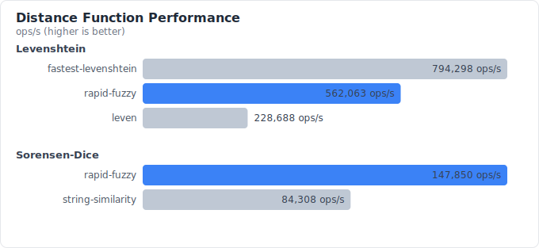
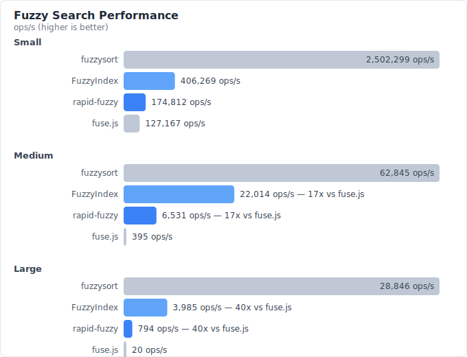

# rapid-fuzzy

[](https://github.com/derodero24/rapid-fuzzy/actions/workflows/ci.yml)
[](https://codspeed.io/derodero24/rapid-fuzzy)
[](https://codecov.io/gh/derodero24/rapid-fuzzy)
[](https://www.npmjs.com/package/rapid-fuzzy)
[](https://www.npmjs.com/package/rapid-fuzzy)
[](https://opensource.org/licenses/MIT)
[](https://nodejs.org/)

Rust-powered fuzzy search and string distance for JavaScript/TypeScript.

> **Status**: Early release (v0.x). API may change between minor versions.

## Features

- **Fast**: Up to 40x faster than fuse.js for large datasets (Rust + napi-rs)
- **Universal**: Works in Node.js (native), browsers (WASM), Deno, and Bun
- **Zero JS dependencies**: Pure Rust core with napi-rs bindings
- **Type-safe**: Full TypeScript support with auto-generated type definitions
- **Drop-in**: API compatible with popular fuzzy search libraries

## Installation

```bash
npm install rapid-fuzzy
# or
pnpm add rapid-fuzzy
```

### Runtime-specific notes

- **Node.js** (>=20): Uses native bindings via napi-rs for best performance.
- **Browser / Deno / Bun**: Falls back to a WASM build automatically.

## Usage

### String Distance

```typescript
import { levenshtein, jaroWinkler, sorensenDice } from 'rapid-fuzzy';

levenshtein('kitten', 'sitting');     // 3
jaroWinkler('MARTHA', 'MARHTA');      // 0.961
sorensenDice('night', 'nacht');       // 0.25
```

### Fuzzy Search

```typescript
import { search, closest } from 'rapid-fuzzy';

// Find matches sorted by relevance (scores normalized to 0.0-1.0)
const results = search('typscript', [
  'TypeScript',
  'JavaScript',
  'Python',
  'TypeSpec',
]);
// → [{ item: 'TypeScript', score: 0.85, index: 0, positions: [] }, ...]

// With options: filter by minimum score and limit results
search('app', items, { maxResults: 5, minScore: 0.3 });

// Backward compatible: pass a number for maxResults
search('app', items, 5);

// Get matched character positions for highlighting
const [match] = search('hlo', ['hello world'], { includePositions: true });
// → { item: 'hello world', score: 0.75, index: 0, positions: [0, 2, 4] }

// Case-sensitive matching (default: smart case)
search('Type', items, { isCaseSensitive: true });

// Find the single best match
closest('tsc', ['TypeScript', 'JavaScript', 'Python']);
// → 'TypeScript'

// With minimum score threshold (returns null if no match is good enough)
closest('xyz', items, 0.5);
// → null
```

### Object Search

Search across object properties with weighted keys — a drop-in replacement for fuse.js's `keys` option:

```typescript
import { searchObjects } from 'rapid-fuzzy';

const users = [
  { name: 'John Smith', email: 'john@example.com' },
  { name: 'Jane Doe', email: 'jane@example.com' },
  { name: 'Bob Johnson', email: 'bob@test.com' },
];

// Search across multiple keys
const results = searchObjects('john', users, {
  keys: ['name', 'email'],
});
// → [{ item: { name: 'John Smith', ... }, score: 0.95, keyScores: [0.98, 0.85], index: 0 }]

// Weighted keys — prioritize name matches over email
searchObjects('john', users, {
  keys: [
    { name: 'name', weight: 2.0 },
    { name: 'email', weight: 1.0 },
  ],
});

// Nested key paths
searchObjects('new york', items, { keys: ['address.city'] });
```

### Persistent Index

For applications that search the same dataset repeatedly (autocomplete, file finders, etc.), use `FuzzyIndex` or `FuzzyObjectIndex` to keep data on the Rust side and eliminate per-search FFI overhead:

```typescript
import { FuzzyIndex, FuzzyObjectIndex } from 'rapid-fuzzy';

// String search index — up to 5x faster than standalone search()
const index = new FuzzyIndex(['TypeScript', 'JavaScript', 'Python', ...]);

index.search('typscript', { maxResults: 5 });
index.closest('tsc');

// Mutate the index without rebuilding
index.add('Rust');
index.remove(2); // swap-remove by index

// Object search index — keeps objects on the JS side, keys on the Rust side
const userIndex = new FuzzyObjectIndex(users, {
  keys: [
    { name: 'name', weight: 2.0 },
    { name: 'email', weight: 1.0 },
  ],
});

userIndex.search('john', { maxResults: 10 });

// Free Rust-side memory when done
index.destroy();
userIndex.destroy();
```

### Match Highlighting

Convert matched positions into highlighted markup for UI rendering:

```typescript
import { search, highlight, highlightRanges } from 'rapid-fuzzy';

const results = search('fzy', ['fuzzy'], { includePositions: true });
const { item, positions } = results[0];

// String markers
highlight(item, positions, '<b>', '</b>');
// → '<b>f</b>u<b>zy</b>'

// Callback (React, JSX, custom DOM)
highlight(item, positions, (matched) => `<mark>${matched}</mark>`);

// Raw ranges for custom rendering
highlightRanges(item, positions);
// → [{ start: 0, end: 1, matched: true }, { start: 1, end: 2, matched: false }, ...]
```

### Token-Based Matching

Order-independent and partial string matching, inspired by Python's [RapidFuzz](https://github.com/rapidfuzz/RapidFuzz):

```typescript
import {
  tokenSortRatio,
  tokenSetRatio,
  partialRatio,
  weightedRatio,
} from 'rapid-fuzzy';

// Token Sort: order-independent comparison
tokenSortRatio('New York Mets', 'Mets New York'); // 1.0

// Token Set: handles extra/missing tokens
tokenSetRatio('Great Gatsby', 'The Great Gatsby by Fitzgerald'); // ~0.85

// Partial: best substring match
partialRatio('hello', 'hello world'); // 1.0

// Weighted: best score across all methods
weightedRatio('John Smith', 'Smith, John'); // 1.0
```

All token-based functions include `Batch` and `Many` variants (e.g., `tokenSortRatioBatch`, `tokenSortRatioMany`).

### Batch Operations

All distance functions have `Batch` and `Many` variants that amortize FFI overhead:

```typescript
import { levenshteinBatch, levenshteinMany } from 'rapid-fuzzy';

// Compute distances for multiple pairs at once
levenshteinBatch([
  ['kitten', 'sitting'],
  ['hello', 'help'],
  ['foo', 'bar'],
]);
// → [3, 2, 3]

// Compare one string against many candidates
levenshteinMany('kitten', ['sitting', 'kittens', 'kitchen']);
// → [3, 1, 2]
```

> **Tip**: Prefer batch/many variants over calling single-pair functions in a loop — they are significantly faster for multiple comparisons.

## Benchmarks

Measured on Apple M-series with Node.js v22 using [Vitest bench](https://vitest.dev/guide/features.html#benchmarking). Each benchmark processes 6 realistic string pairs of varying length and similarity.

### Distance Functions



<details>
<summary>Raw numbers</summary>

| Function | rapid-fuzzy | fastest-levenshtein | leven | string-similarity |
|---|---:|---:|---:|---:|
| Levenshtein | 528,195 ops/s | **739,107 ops/s** | 221,817 ops/s | — |
| Normalized Levenshtein | **534,231 ops/s** | — | — | — |
| Sorensen-Dice | **149,567 ops/s** | — | — | 82,908 ops/s |
| Jaro-Winkler | **278,554 ops/s** | — | — | — |
| Damerau-Levenshtein | **112,370 ops/s** | — | — | — |

</details>

> **Note**: For single-pair Levenshtein, fastest-levenshtein is ~1.4x faster due to its optimized pure-JS implementation that avoids FFI overhead. rapid-fuzzy is **2.4x faster** than leven, and provides broader algorithm coverage plus batch / search scenarios.

### Search Performance



<details>
<summary>Raw numbers</summary>

| Dataset size | rapid-fuzzy | FuzzyIndex | fuse.js | fuzzysort |
|---|---:|---:|---:|---:|
| Small (20 items) | 174,812 ops/s | 406,269 ops/s | 127,167 ops/s | **2,502,299 ops/s** |
| Medium (1K items) | 6,531 ops/s | 22,014 ops/s | 395 ops/s | **62,845 ops/s** |
| Large (10K items) | 794 ops/s | 3,985 ops/s | 20 ops/s | **28,846 ops/s** |

</details>

### Closest Match (Levenshtein-based)

| Dataset size | rapid-fuzzy | FuzzyIndex | fastest-levenshtein |
|---|---:|---:|---:|
| Medium (1K items) | 8,304 ops/s | **60,469 ops/s** | 8,946 ops/s |
| Large (10K items) | 757 ops/s | **4,103 ops/s** | 604 ops/s |

> With `FuzzyIndex`, rapid-fuzzy is up to **6.8x faster** than fastest-levenshtein for closest-match lookups.

### Why these numbers matter

- **vs fuse.js**: rapid-fuzzy is **17x faster** on medium datasets and **40x faster** on large datasets for fuzzy search.
- **FuzzyIndex**: Pre-computing string data on the Rust side gives an additional **3–5x speedup** over standalone `search()`, making it the recommended approach for repeated searches.
- **vs fastest-levenshtein**: With `FuzzyIndex`, closest-match is **6.8x faster** at scale. Even standalone `closest()` wins on large datasets.
- **fuzzysort** uses a different (substring-based) matching algorithm that is extremely fast but produces different ranking results. Choose based on your matching needs.

Run benchmarks yourself:

```bash
pnpm run bench        # JavaScript benchmarks
cargo bench           # Rust internal benchmarks
```

## Choosing an Algorithm

| Use case | Recommended | Why |
|---|---|---|
| Typo detection / spell check | `levenshtein`, `damerauLevenshtein` | Counts edits; Damerau adds transposition support |
| Name / address matching | `jaroWinkler`, `tokenSortRatio` | Prefix-weighted or order-independent matching |
| Document / text similarity | `sorensenDice` | Bigram-based; handles longer text well |
| Normalized comparison (0–1) | `normalizedLevenshtein` | Length-independent similarity score |
| Reordered words / messy data | `tokenSortRatio`, `tokenSetRatio` | Handles word order differences and extra tokens |
| Substring / abbreviation matching | `partialRatio` | Finds best partial match within longer strings |
| Best-effort similarity | `weightedRatio` | Picks the best score across all methods automatically |
| Interactive fuzzy search | `search`, `closest` | Nucleo algorithm (same as Helix editor) |
| Repeated search on same data | `FuzzyIndex`, `FuzzyObjectIndex` | Persistent Rust-side index, 3–5x faster than standalone |

**Return types:**

- `levenshtein`, `damerauLevenshtein` → integer (edit count)
- `jaro`, `jaroWinkler`, `sorensenDice`, `normalizedLevenshtein` → float between 0.0 (no match) and 1.0 (identical)
- `tokenSortRatio`, `tokenSetRatio`, `partialRatio`, `weightedRatio` → float between 0.0 and 1.0
- `search` → array of `{ item, score, index, positions }` sorted by relevance (score: 0.0–1.0)

## Why rapid-fuzzy?

| | rapid-fuzzy | fuse.js | fastest-levenshtein | fuzzysort |
|---|:---:|:---:|:---:|:---:|
| **Algorithms** | 9 (Levenshtein, Jaro, Dice, …) | Bitap | Levenshtein | Substring |
| **Runtime** | Rust native + WASM | Pure JS | Pure JS | Pure JS |
| **Object search** | ✅ weighted keys | ✅ | — | ✅ |
| **Persistent index** | ✅ FuzzyIndex / FuzzyObjectIndex | — | — | ✅ prepared targets |
| **Score threshold** | ✅ | ✅ | — | ✅ |
| **Match positions** | ✅ | ✅ | — | ✅ |
| **Highlight utility** | ✅ | — | — | ✅ |
| **Batch API** | ✅ | — | — | — |
| **Node.js native** | ✅ napi-rs | — | — | — |
| **Browser** | ✅ WASM | ✅ | ✅ | ✅ |
| **TypeScript** | ✅ full | ✅ full | ✅ | ✅ |

## Migration Guides

Switching from another library? These guides provide API mapping tables, code examples, and performance comparisons:

- [**From string-similarity**](docs/migration/from-string-similarity.md) — Same Dice coefficient algorithm, now maintained and faster
- [**From fuse.js**](docs/migration/from-fuse-js.md) — 17–40x faster fuzzy search with a simpler API
- [**From leven / fastest-levenshtein**](docs/migration/from-leven.md) — Multi-algorithm upgrade with batch APIs

## License

MIT
