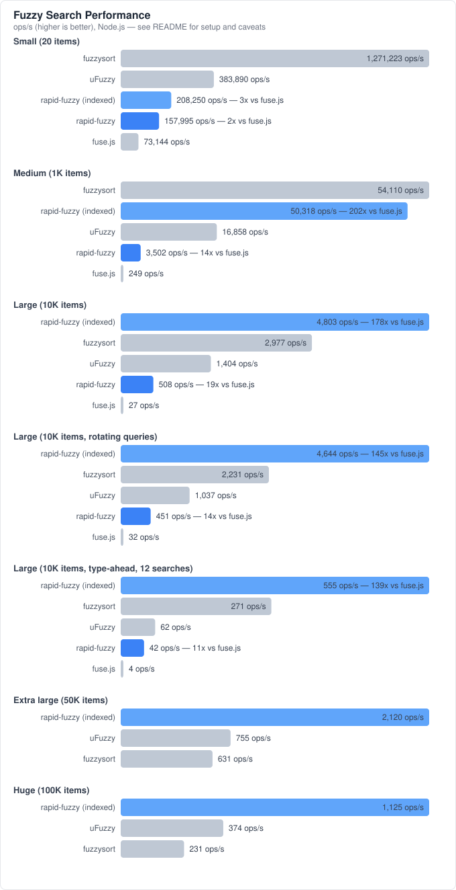
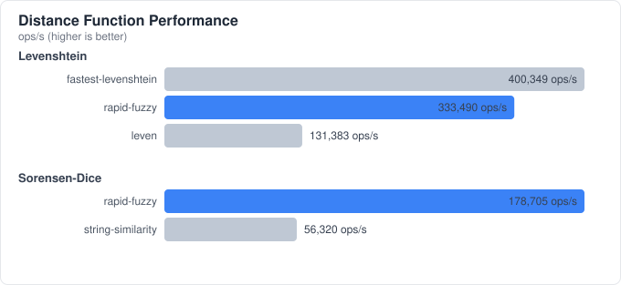

# rapid-fuzzy

[](https://github.com/derodero24/rapid-fuzzy/actions/workflows/ci.yml)
[](https://codspeed.io/derodero24/rapid-fuzzy)
[](https://codecov.io/gh/derodero24/rapid-fuzzy)
[](https://www.npmjs.com/package/rapid-fuzzy)
[](https://www.npmjs.com/package/rapid-fuzzy)
[](https://opensource.org/licenses/MIT)
[](https://nodejs.org/)

Blazing-fast fuzzy search for JavaScript — powered by Rust, works everywhere.

## Features

- **Fast**: Rust core with native Node.js bindings (napi-rs). A persistent `FuzzyIndex` answers a query over 10,000 items in about 0.2 ms in our benchmark, about 180x faster than fuse.js and 1.6x faster than fuzzysort with prepared targets (fuzzysort is faster on small lists) — [see benchmarks](#benchmarks)
- **Universal**: Works in Node.js (native), browsers (WASM), Deno, and Bun
- **Zero JS dependencies**: Pure Rust core with napi-rs bindings
- **Type-safe**: Full TypeScript support with auto-generated type definitions
- **Fuzzy search and string distance in one package**: nucleo-based fuzzy search, weighted object search, and 7 distance metrics plus 4 token-based ratios, with [migration guides](#migration-guides) from popular libraries

## Playground

Try rapid-fuzzy in the browser — no installation required: **[Open Playground](https://derodero24.github.io/rapid-fuzzy/)**

## Quick Start

```typescript
import { search } from 'rapid-fuzzy';

const results = search('typscript', ['TypeScript', 'JavaScript', 'Python']);
// → [{ item: 'TypeScript', score: 0.86, index: 0, positions: [] }]
```

For repeated searches over the same items, build a `FuzzyIndex` once: it keeps the items on the Rust side and was about 10x faster per query than `search()` on 1,000-10,000 items in our [benchmarks](#benchmarks):

```typescript
import { FuzzyIndex } from 'rapid-fuzzy';

const index = new FuzzyIndex(['TypeScript', 'JavaScript', 'Python', ...]);
index.search('typscript'); // same results as search('typscript', items)
```

## Installation

```bash
npm install rapid-fuzzy
# or
pnpm add rapid-fuzzy
```

### Runtime-specific notes

- **Node.js** (>=22): Uses native bindings via napi-rs for best performance. On a platform without a prebuilt binary, install the WASI fallback alongside the package (`npm install rapid-fuzzy rapid-fuzzy-wasm32-wasi`, requires Node 22.13+ or 23.5+); the loader picks it up automatically, or set `NAPI_RS_FORCE_WASI=true` to prefer it over the native binding.
- **Bun**: Uses native napi-rs bindings. The WASM build is available with `--conditions=browser` — see [Bun section](#bun) below.
- **Browsers / CDN / Cloudflare Workers / Deno**: Use the wasm-bindgen WASM build (a ~500 KB `.wasm` file, ~185 KB gzipped, plus ~80 KB of JS glue, ~10 KB gzipped), selected automatically through the package's `browser`, `workerd` and `deno` export conditions. No `SharedArrayBuffer` or COOP/COEP headers required.

### Framework Integration (SSR)

Native modules need to be externalized in SSR frameworks:

**Next.js**

```js
// next.config.js
const nextConfig = {
  serverExternalPackages: ['rapid-fuzzy'],
};
```

**Vite SSR**

```js
// vite.config.js
export default {
  ssr: {
    external: ['rapid-fuzzy'],
  },
};
```

On the client side, bundlers pick the WASM build through the `browser` export condition — no additional configuration needed (tested with Next.js 16 client components, both Turbopack and webpack, and Vite 8). The Next.js / Vercel Edge runtime is not supported: use the default Node.js runtime for server code.

### Browser and Edge Runtime Usage

The browser build (`rapid-fuzzy` resolved with the `browser` condition) instantiates the WebAssembly module with top-level `await` while it is imported, so the API is synchronous and ready to use once the `import` resolves — there is no `init()` to call. It exports the same functions as the Node.js entry, and `rapid-fuzzy/highlight` and `rapid-fuzzy/objects` work as well. The only differences: `FuzzyObjectIndex` has no `serialize()` / `deserialize()` (they exchange Node.js Buffers), and `FuzzyIndex.fromAsync()` builds the index synchronously. The WASM build is ES-module-only, so `require('rapid-fuzzy')` keeps loading the Node.js entry even where the `browser` condition is set (for example in Jest with `jest-environment-jsdom`).

#### Bundlers

| Bundler | Setup |
| --- | --- |
| Vite 8 (build and dev server), webpack 5, Next.js 16 (Turbopack and webpack) | None. The `.wasm` is emitted as an asset from its `new URL(..., import.meta.url)` reference. |
| esbuild, `bun build` | Copy `node_modules/rapid-fuzzy/rapid-fuzzy-wasm-bindgen_bg.wasm` next to the output bundle: these bundlers keep the `new URL('./rapid-fuzzy-wasm-bindgen_bg.wasm', import.meta.url)` reference but do not emit the file. |

The build target must support top-level `await` (ES2022; the defaults of the bundlers above do).

#### CDN (no bundler required)

The browser build is plain ES modules, so it runs directly from a CDN that serves the package files unmodified, such as [jsDelivr](https://www.jsdelivr.com/) or [unpkg](https://unpkg.com/):

```html
<script type="module">
  import { search, FuzzyIndex } from 'https://cdn.jsdelivr.net/npm/rapid-fuzzy@2/browser.mjs';

  const results = search('typscript', ['TypeScript', 'JavaScript', 'Python']);
  console.log(results[0].item); // 'TypeScript'

  const index = new FuzzyIndex(['TypeScript', 'JavaScript', 'Python']);
  console.log(index.search('typscript')[0].item); // 'TypeScript'
  index.destroy();
</script>
```

Pin an exact version in production (`rapid-fuzzy@2.2.0`). `highlight` and the object search functions are exported by `browser.mjs` too; `https://cdn.jsdelivr.net/npm/rapid-fuzzy@2/highlight.browser.mjs` provides `highlight` alone, without loading the WebAssembly module. See [`examples/cdn-usage/`](examples/cdn-usage/) for a complete HTML example.

#### Cloudflare Workers

Install the package and import it in your Worker script. Wrangler resolves the `workerd` export condition and bundles the WASM binary as a precompiled module automatically — no `nodejs_compat` flag needed:

```bash
npm install rapid-fuzzy
```

```js
// worker.js
import { search, FuzzyIndex } from 'rapid-fuzzy';

// Create the index once at module scope (shared across requests)
const index = new FuzzyIndex(['hello', 'world', 'foo', 'bar']);

export default {
  fetch(request) {
    const { searchParams } = new URL(request.url);
    const query = searchParams.get('q') ?? '';
    const results = index.search(query);
    return Response.json(results);
  },
};
```

```toml
# wrangler.toml
name = "rapid-fuzzy-worker"
main = "worker.js"
compatibility_date = "2025-01-01"
```

See [`examples/cloudflare-workers/`](examples/cloudflare-workers/) for a complete example (tested with Wrangler 4).

#### Deno

Use rapid-fuzzy via the `npm:` specifier. Deno resolves the `deno` export condition to the WASM build, which reads its `.wasm` file from the npm cache, so run with `--allow-read`:

```ts
import { search } from 'npm:rapid-fuzzy';

const results = search('typscript', ['TypeScript', 'JavaScript', 'Python']);
console.log(results[0].item); // 'TypeScript'
```

```bash
deno run --allow-read main.ts
```

#### Bun

Bun uses the native napi-rs bindings by default (fastest). To use the WASM build instead — for example to test the code path your browser bundle takes — run with the `browser` condition:

```bash
bun --conditions=browser run main.ts
```

The same works in Node.js (`node --conditions=browser main.mjs`).

## API

### Fuzzy Search

```typescript
import { search, closest } from 'rapid-fuzzy';

// Find matches sorted by relevance (scores normalized to 0.0-1.0)
const results = search('typscript', [
  'TypeScript',
  'JavaScript',
  'Python',
  'TypeSpec',
]);
// → [{ item: 'TypeScript', score: 0.86, index: 0, positions: [] }]

// With options: filter by minimum score and limit results
// (maxResults: a non-negative integer, or Infinity for no limit)
search('app', items, { maxResults: 5, minScore: 0.3 });

// Get matched character positions for highlighting
const [match] = search('hlo', ['hello world'], { includePositions: true });
// → { item: 'hello world', score: 0.77, index: 0, positions: [0, 3, 4], matchType: 'Fuzzy' }

// Case-sensitive matching. The default (and isCaseSensitive: false) is smart
// case: case-insensitive while the query is all lower-case, case-sensitive as
// soon as it contains an upper-case letter.
search('type', items, { isCaseSensitive: true });

// Return all items when query is empty (useful for filter-as-you-type UIs)
search('', items, { returnAllOnEmpty: true });

// Find the single best match (the first result of search())
closest('tsc', ['TypeScript', 'JavaScript', 'Python']);
// → 'TypeScript'

// With minimum score threshold (returns null if no match is good enough)
closest('xyz', items, 0.5);
// → null
```

### String Distance

```typescript
import {
  levenshtein,
  normalizedLevenshtein,
  damerauLevenshtein,
  jaro,
  jaroWinkler,
  sorensenDice,
  hamming,
  normalizedHamming,
  indel,
  normalizedIndel,
} from 'rapid-fuzzy';

levenshtein('kitten', 'sitting');     // 3
normalizedLevenshtein('kitten', 'sitting'); // 0.571 (1 - 3 / 7)
damerauLevenshtein('ab', 'ba');       // 1 (an adjacent transposition is one edit)
jaro('martha', 'marhta');             // 0.944 (similarity between 0–1)
jaroWinkler('MARTHA', 'MARHTA');      // 0.961 (jaro + prefix bonus)
sorensenDice('night', 'nacht');       // 0.25
hamming('karolin', 'kathrin');        // 3 (null if lengths differ)
normalizedHamming('karolin', 'kathrin'); // 0.571 (similarity 0–1, null if lengths differ)
indel('abc', 'ac');                   // 1 (insertions + deletions only, no substitutions)
normalizedIndel('kitten', 'sitting'); // 0.615 (similarity 0–1)
```

These functions compare the strings' Unicode code points exactly as given: they do not ignore case or whitespace and do not normalize Unicode (`levenshtein('Cafe', 'cafe')` is 1, and a precomposed `é` differs from `e` + combining accent). Lower-case or [normalize](#unicode-and-non-latin-scripts) the input first if that matters to you. `sorensenDice` removes whitespace before comparing; the token-based functions (see *Token-Based Matching* below) lower-case their input.

### Query Syntax

Queries support extended syntax powered by the [nucleo](https://github.com/helix-editor/nucleo) pattern parser:

| Pattern | Match type | Example |
|---|---|---|
| `foo bar` | AND (order-independent) | `john smith` matches "Smith, John" |
| `!term` | Exclude | `apple !pie` excludes "apple pie" |
| `^term` | Starts with | `^app` matches "apple" but not "pineapple" |
| `term$` | Ends with | `pie$` matches "apple pie" |
| `'term` | Exact substring | `'pie` matches "pie" literally |

Diacritics are handled automatically — `cafe` matches `café`, `uber` matches `über`, and `naive` matches `naïve` with no configuration needed.

In `search()`, `closest()` and `FuzzyIndex`, terms are separated by any whitespace, including the ideographic space (U+3000) typed by Japanese and Chinese input methods, so `東京　港区` searches for both terms. Escape a space with a backslash (`foo\ bar`) to match it literally. A query made only of syntax (such as `^` or `!`) has no search term and is treated like an empty query, and a single term longer than 2,520 characters cannot be scored and matches nothing.

> **Note**: These patterns apply to all search functions: `search()`, `closest()`, `FuzzyIndex.search()`, `FuzzyObjectIndex.search()`, and `searchObjects()`. They do **not** apply to distance functions (`levenshtein`, `jaro`, etc.).

### How Matching and Scoring Work

Search uses the [nucleo](https://github.com/helix-editor/nucleo) matcher, the one in the Helix editor. Each query term matches an item when all of its characters occur in the item **in order** (a subsequence match): `tsc` matches `TypeScript`, and `typscript` matches `TypeScript` because the query only *omits* a letter. Typos that **substitute or swap** letters do not match: `tpyescript` and `typozcript` find nothing in `['TypeScript']`. To tolerate those, compare strings with a [distance function](#string-distance) instead (for example `levenshteinMany` or `jaroWinklerMany` over your candidates).

- **Scores** are nucleo's scores normalized to 0.0–1.0, where 1.0 is the best score the query can get: typically the query appears verbatim at the start of the item or of a space-separated word. Matches at the start of the item, after a space or other delimiter (`-`, `_`, `.`, `/`), at camelCase humps and in consecutive runs score higher, so `york` scores 1.0 against `new york city` but 0.67 against `newyorkcity`. A query with several terms gets the average of its terms' scores. Scores are for ranking: they are not a percentage of similarity, and they are not comparable with fuse.js or fuzzysort scores. Pick `minScore` by looking at scores on your own data.
- **Case**: smart case by default — a query in lower case matches any case; a query with an upper-case letter is matched case-sensitively. `isCaseSensitive: true` makes every query case-sensitive. There is no option that forces case-insensitive matching for a query with capitals; lower-case the query instead.
- **Ties** are broken by item length (shorter first), then by index.

### Object Search

Search across object properties with weighted keys, similar to fuse.js's `keys` option:

```typescript
import { searchObjects } from 'rapid-fuzzy';

const users = [
  { name: 'John Smith', email: 'john@example.com' },
  { name: 'Jane Doe', email: 'jane@example.com' },
  { name: 'Bob Johnson', email: 'bob@test.com' },
];

// Search across multiple keys
const results = searchObjects('john', users, {
  keys: ['name', 'email'],
});
// → [
//   { item: { name: 'John Smith', ... }, index: 0, score: 1, keyScores: [1, 1] },
//   { item: { name: 'Bob Johnson', ... }, index: 2, score: 0.5, keyScores: [1, 0] },
// ]

// Weighted keys — prioritize name matches over email
searchObjects('john', users, {
  keys: [
    { name: 'name', weight: 2.0 },
    { name: 'email', weight: 1.0 },
  ],
});
// → John Smith scores 1, Bob Johnson (2 * 1 + 1 * 0) / 3 = 0.667

// Nested key paths
searchObjects('new york', items, { keys: ['address.city'] });
```

The combined score is the weighted average of the per-key scores (`keyScores`, one per key, each computed like `search()` scores a string). A key with weight `0` is still scored in `keyScores` but never selects an item on its own. Ties are broken like `search()`: the item whose best-matching key text is shorter comes first, then the lower index.

Key paths read own properties (`'address.city'`, array elements as `'tags.0'`). Strings are indexed as-is; numbers, booleans, bigints and objects with their own `toString()` (such as `Date`) via `String()`; arrays as their elements joined with spaces; missing values, `null` and plain objects as an empty string. In TypeScript, key names written as literals are checked against the item type. `includePositions` has no effect on object search.

`searchObjects()` and `FuzzyObjectIndex` are also exported from `rapid-fuzzy/objects`. They are built on two lower-level APIs that take column-oriented key texts and return item indices, which you can use directly:

```typescript
import { searchKeys, KeyedFuzzyIndex } from 'rapid-fuzzy';

// keyTexts[k][i] is the text of key k for item i; one weight per key
const keyTexts = [
  ['John Smith', 'Jane Doe'],
  ['john@example.com', 'jane@example.com'],
];
searchKeys('jane', keyTexts, [2, 1]);
// → [{ index: 1, score: 1, keyScores: [1, 1] }]

const keyed = new KeyedFuzzyIndex(keyTexts, [2, 1]);
keyed.search('jane', { maxResults: 10 }); // same results as searchKeys()
keyed.closest('jane');                    // → 1 (an index, or null)
```

### Persistent Index

For applications that search the same dataset repeatedly (autocomplete, file finders, etc.), use `FuzzyIndex` or `FuzzyObjectIndex` to keep the data on the Rust side instead of converting it on every search.

**When to use which:** The standalone `search()` function requires zero setup and is ideal for one-off queries or small datasets. `FuzzyIndex` has an initial build cost (about 2 ms for 10,000 short items) but then skips converting the items on every query — about 10x faster per query than `search()` on 1,000-10,000 items in our [benchmarks](#benchmarks) — making it the better choice when querying the same dataset multiple times (autocomplete, live search, file finders).

```typescript
import { FuzzyIndex, FuzzyObjectIndex } from 'rapid-fuzzy';

// String search index
const index = new FuzzyIndex(['TypeScript', 'JavaScript', 'Python', ...]);
index.size; // number of items

index.search('typscript', { maxResults: 5 }); // or index.search('typscript', 5)
index.closest('tsc');

// Results are always identical to search(query, items, options).

// Index-only results (no string cloning — less GC pressure)
const hits = index.searchIndices('typscript', { maxResults: 5 });
// → [{ index: 0, score: 0.86, positions: [] }]

// Mutate the index without rebuilding
index.add('Rust');
index.addMany(['Go', 'Zig']);
index.remove(2); // swap-remove: the last item moves to position 2; false if out of range

// Build a large index on the libuv thread pool instead of the main thread
const big = await FuzzyIndex.fromAsync(manyStrings);

// Object search index — keeps objects on the JS side, keys on the Rust side
const userIndex = new FuzzyObjectIndex(users, {
  keys: [
    { name: 'name', weight: 2.0 },
    { name: 'email', weight: 1.0 },
  ],
});

userIndex.search('john', { maxResults: 10 });

// Free Rust-side memory when done
index.destroy();
userIndex.destroy();
```

`FuzzyObjectIndex` (also exported from `rapid-fuzzy/objects`) has the same methods: `size`, `search(query, options | maxResults)`, `closest(query, minScore?)` (returns the object or `null`), `add`, `addMany`, `remove`, `destroy`, and in Node.js `serialize()` / `FuzzyObjectIndex.deserialize()` (items must be JSON-serializable).

After `destroy()`, an index releases its Rust-side memory but stays usable: it behaves as an empty index (searches return no results, `size` is 0), and `add()` / `addMany()` work as before.

#### Incremental Search (Autocomplete)

`FuzzyIndex` remembers which items matched the previous query. When the next query only appends characters to it (typing `app` → `apple`), only those items are re-scored:

```typescript
const index = new FuzzyIndex(items);
index.search('app');    // scores all items, remembers the matches
index.search('apple');  // re-scores only the items that matched 'app'
index.search('xyz');    // not an extension — full scan
```

The cache is only used for plain extensions (not once the query contains `!`, `^`, `$`, `'` or `\`), a search with a positive `minScore` does not update it, and results are the same with or without it. In our type-ahead benchmark (12 keystrokes over 10,000 items) a whole sequence took about 1.6 ms.

#### Index Serialization

Save a `FuzzyIndex` and restore it later:

```typescript
import { FuzzyIndex } from 'rapid-fuzzy';

const index = new FuzzyIndex(['apple', 'banana', 'cherry']);

// Serialize to Buffer
const data = index.serialize();

// Restore from serialized data
const restored = FuzzyIndex.deserialize(data);
restored.search('aple'); // works immediately
```

The data holds the item strings (UTF-8, 4 bytes of length each, plus a 12-byte header), not precomputed search data: `deserialize()` recomputes that, so loading takes about as long as `new FuzzyIndex(items)`. It is useful for persisting an index you built up with `add()` / `remove()` without keeping the source array around. In the browser build, `serialize()` returns a `Uint8Array` and `deserialize()` takes one.

> **Note:** The data starts with a format version. `deserialize()` rejects data written with a different format version (and throws on corrupt data), so keep the source data or be ready to rebuild the index after upgrading rapid-fuzzy.

### Match Highlighting

Convert matched positions into highlighted markup for UI rendering:

```typescript
import { search, highlight, highlightRanges } from 'rapid-fuzzy';

const results = search('fzy', ['fuzzy'], { includePositions: true });
const { item, positions } = results[0];

// String markers
highlight(item, positions, '<b>', '</b>');
// → '<b>f</b>uz<b>zy</b>'

// Callback (custom markup, returned as one string)
highlight(item, positions, (matched) => `<mark>${matched}</mark>`);

// highlight() does not escape HTML; pass escapeHtml when the text is untrusted
highlight('<b>&', [1], '<mark>', '</mark>', { escapeHtml: true });
// → '&lt;<mark>b</mark>&gt;&amp;'

// Raw ranges for custom rendering (React, JSX, custom DOM)
highlightRanges(item, positions);
// → [{ start: 0, end: 1, matched: true }, { start: 1, end: 3, matched: false },
//    { start: 3, end: 5, matched: true }]
```

`highlight` and `highlightRanges` are also available from `rapid-fuzzy/highlight`, which does not load the native addon or the WebAssembly module.

<details>
<summary><strong>Token-Based Matching</strong></summary>

Order-independent and partial string matching, inspired by Python's [RapidFuzz](https://github.com/rapidfuzz/RapidFuzz). These functions lower-case their input and split it on whitespace (`partialRatio` collapses whitespace), so they are case-insensitive, unlike the distance functions above. Scores are on a 0.0–1.0 scale and are not always equal to RapidFuzz's or fuzzball's (see the [fuzzball migration guide](docs/migration/from-fuzzball.md)):

```typescript
import {
  tokenSortRatio,
  tokenSetRatio,
  partialRatio,
  weightedRatio,
} from 'rapid-fuzzy';

// Token Sort: order-independent comparison
tokenSortRatio('New York Mets', 'Mets New York'); // 1.0

// Token Set: handles extra/missing tokens
tokenSetRatio('Great Gatsby', 'The Great Gatsby by Fitzgerald'); // 1.0 (all tokens of one side are present)

// Partial: the shorter string against every same-length window of the longer one
partialRatio('hello', 'hello world'); // 1.0

// Weighted: the highest of normalizedLevenshtein, tokenSortRatio, tokenSetRatio
// and partialRatio (no length-based scaling, unlike WRatio in RapidFuzz / fuzzball)
weightedRatio('John Smith', 'Smith John'); // 1.0
```

All token-based functions include `Batch` and `Many` variants (e.g., `tokenSortRatioBatch`, `tokenSortRatioMany`). `partialRatio` and `weightedRatio` are expensive on long strings; see [Performance and Untrusted Input](#performance-and-untrusted-input).

</details>

<details>
<summary><strong>Batch Operations</strong></summary>

All distance functions have `Batch` and `Many` variants that make one call across the JS/Rust boundary instead of one per pair. `*Batch` functions compute metrics for multiple pairs at once, while `*Many` functions compare a single reference string against multiple candidates and reuse the work that only depends on the reference.

- **`*Batch`** — compute distances for an array of string pairs (many-to-many)
- **`*Many`** — compare one reference string against many candidates (one-to-many)

```typescript
import { levenshteinBatch, levenshteinMany } from 'rapid-fuzzy';

// Compute distances for multiple pairs at once
levenshteinBatch([
  ['kitten', 'sitting'],
  ['hello', 'help'],
  ['foo', 'bar'],
]);
// → [3, 2, 3]

// Compare one string against many candidates
levenshteinMany('kitten', ['sitting', 'kittens', 'kitchen']);
// → [3, 1, 2]

// With early-termination threshold (skip candidates that can't match)
levenshteinMany('kitten', candidates, 3);        // maxDistance → returns 4 for exceeding
jaroWinklerMany('MARTHA', candidates, 0.8);       // minSimilarity → returns 0.0 for below
```

A `*Batch` pair that is not exactly two strings throws an `InvalidArg` error, and so does a `NaN` `minSimilarity`.

> **Tip**: For one reference against many candidates, prefer the `*Many` variant: in our benchmark `levenshteinMany` over 1,000 short candidates was about 1.5x faster than calling `levenshtein` in a loop. For a handful of short pairs, `*Batch` is not faster than single calls.

</details>

<details>
<summary><strong>TypedArray Variants</strong></summary>

All `*Many` functions have TypedArray counterparts that return `Uint32Array` or `Float64Array` instead of `Array<number>`. These avoid boxing overhead and GC pressure when processing large candidate sets.

- **`*ManyU32`** — returns `Uint32Array` (for integer distances: `levenshteinManyU32`, `damerauLevenshteinManyU32`, `indelManyU32`)
- **`*ManyF64`** — returns `Float64Array` (for similarity scores: `jaroManyF64`, `jaroWinklerManyF64`, `normalizedLevenshteinManyF64`, `normalizedIndelManyF64`, `sorensenDiceManyF64`, `tokenSortRatioManyF64`, `tokenSetRatioManyF64`, `partialRatioManyF64`, `weightedRatioManyF64`)
- **`hammingManyU32`** / **`normalizedHammingManyF64`** — a typed array cannot hold `null`, so a candidate of a different length (or one filtered out by the threshold) becomes `0xffffffff` / `NaN`

```typescript
import { levenshteinManyU32, jaroWinklerManyF64 } from 'rapid-fuzzy';

const candidates = ['sitting', 'kittens', 'kitchen'];

// Returns Uint32Array instead of Array<number>
levenshteinManyU32('kitten', candidates);       // Uint32Array [3, 1, 2]

// Returns Float64Array instead of Array<number>
jaroWinklerManyF64('kitten', candidates);       // Float64Array [0.746, 0.971, 0.894]
```

> **When to use**: Prefer TypedArray variants when comparing against thousands of candidates. A typed array's buffer can also be transferred to a worker thread (`postMessage(data, [data.buffer])`) without copying.

</details>

## Framework Integration

`FuzzyIndex` and `FuzzyObjectIndex` are designed for repeated search on the same data — build the index once, search many times. The examples below show the recommended pattern for each major framework.

### React

```tsx
import { useEffect, useRef, useState } from 'react';
import { FuzzyObjectIndex } from 'rapid-fuzzy/objects';

const users = [
  { name: 'Alice', email: 'alice@example.com' },
  { name: 'Bob', email: 'bob@example.com' },
];

function UserSearch() {
  const indexRef = useRef<FuzzyObjectIndex<typeof users[number]> | null>(null);
  const [query, setQuery] = useState('');
  const [results, setResults] = useState(users);

  useEffect(() => {
    indexRef.current = new FuzzyObjectIndex(users, {
      keys: [{ name: 'name', weight: 2.0 }, 'email'],
    });
    return () => indexRef.current?.destroy();
  }, []); // rebuild only when data changes — pass `users` as dependency if dynamic

  useEffect(() => {
    if (!indexRef.current) return;
    if (!query) { setResults(users); return; }
    setResults(indexRef.current.search(query).map((r) => r.item));
  }, [query]);

  return (
    <>
      <input value={query} onChange={(e) => setQuery(e.target.value)} placeholder="Search…" />
      <ul>{results.map((u) => <li key={u.email}>{u.name}</li>)}</ul>
    </>
  );
}
```

### Vue

```vue
<script setup lang="ts">
import { ref, watch, onUnmounted } from 'vue';
import { FuzzyObjectIndex } from 'rapid-fuzzy/objects';

const users = [
  { name: 'Alice', email: 'alice@example.com' },
  { name: 'Bob', email: 'bob@example.com' },
];

const query = ref('');
const results = ref(users);

const index = new FuzzyObjectIndex(users, {
  keys: [{ name: 'name', weight: 2.0 }, 'email'],
});

watch(query, (q) => {
  results.value = q ? index.search(q).map((r) => r.item) : users;
});

onUnmounted(() => index.destroy());
</script>

<template>
  <input v-model="query" placeholder="Search…" />
  <ul><li v-for="u in results" :key="u.email">{{ u.name }}</li></ul>
</template>
```

### Svelte

```svelte
<script lang="ts">
  import { onDestroy } from 'svelte';
  import { FuzzyObjectIndex } from 'rapid-fuzzy/objects';

  const users = [
    { name: 'Alice', email: 'alice@example.com' },
    { name: 'Bob', email: 'bob@example.com' },
  ];

  let query = '';

  const index = new FuzzyObjectIndex(users, {
    keys: [{ name: 'name', weight: 2.0 }, 'email'],
  });

  $: results = query ? index.search(query).map((r) => r.item) : users;

  onDestroy(() => index.destroy());
</script>

<input bind:value={query} placeholder="Search…" />
<ul>{#each results as u}<li>{u.name}</li>{/each}</ul>
```

> **Note**: Always call `index.destroy()` in your cleanup handler (`useEffect` return, `onUnmounted`, `onDestroy`) to free Rust-side memory.

## Choosing an Algorithm

| Use case | Recommended | Why |
|---|---|---|
| Typo detection / spell check | `levenshtein`, `damerauLevenshtein` | Counts edits; Damerau adds transposition support |
| Insertion/deletion only edits | `indel`, `normalizedIndel` | No substitutions — useful for diff-like or DNA alignment scenarios |
| Fixed-length comparison | `hamming`, `normalizedHamming` | Counts differing positions; only for equal-length strings |
| Name / address matching | `jaroWinkler`, `tokenSortRatio` | Prefix-weighted or order-independent matching |
| Character-level similarity | `jaro` | Good baseline similarity without prefix weighting |
| Document / text similarity | `sorensenDice` | Bigram-based; handles longer text well |
| Normalized comparison (0–1) | `normalizedLevenshtein` | Length-independent similarity score |
| Reordered words / messy data | `tokenSortRatio`, `tokenSetRatio` | Handles word order differences and extra tokens |
| Substring / truncation matching | `partialRatio` | Best match of the shorter string within the longer one (not abbreviations) |
| Best-effort similarity | `weightedRatio` | Highest of the Levenshtein ratio, token sort, token set and partial ratios |
| Interactive fuzzy search | `search`, `closest` | Nucleo subsequence matching (same as Helix editor); tolerates omitted letters, not substituted ones |
| Repeated search on same data | `FuzzyIndex`, `FuzzyObjectIndex` | Persistent Rust-side index with incremental cache, ~10x faster per query than `search()` |

**Return types:**

- `levenshtein`, `damerauLevenshtein`, `hamming`, `indel` → integer (edit/difference count; `hamming` returns `null` if lengths differ)
- `jaro`, `jaroWinkler`, `sorensenDice`, `normalizedLevenshtein`, `normalizedIndel` → float between 0.0 (no match) and 1.0 (identical)
- `normalizedHamming` → float between 0.0 and 1.0 (`null` if lengths differ)
- `tokenSortRatio`, `tokenSetRatio`, `partialRatio`, `weightedRatio` → float between 0.0 and 1.0
- `search` → array of `{ item, score, index, positions, matchType? }` sorted by relevance (score: 0.0–1.0; `positions` and `matchType` — `'Exact'`, `'Prefix'`, `'Contains'` or `'Fuzzy'`, also exported as the `MatchType` enum — are filled in with `includePositions: true`)
- `searchObjects` / `FuzzyObjectIndex.search` → array of `{ item, index, score, keyScores }`

### Memory Usage

`FuzzyIndex` and `FuzzyObjectIndex` store the item strings and precomputed search data (a character mask per item and, for non-ASCII items, their UTF-32 text) on the Rust side. Call `.destroy()` when the index is no longer needed to free this memory immediately rather than waiting for garbage collection.

For read-heavy workloads, prefer `searchIndices()` over `search()` — it returns only indices and scores without cloning item strings back to JavaScript, reducing GC pressure.

Serialized indexes contain the item strings plus 4 bytes per item (see [Index Serialization](#index-serialization)), so they are slightly larger than the raw text.

### Error Handling

- `hamming()` / `normalizedHamming()` return `null` when the input strings have different lengths.
- `closest()` returns `null` if no item matches the query, if the best match scores below `minScore`, or if the item list is empty.
- Methods of a `FuzzyIndex`, `FuzzyObjectIndex` or `KeyedFuzzyIndex` do not throw after `.destroy()`: the index behaves as an empty one and accepts new items.
- `maxResults` must be a non-negative integer or `Infinity`; `NaN`, negative or fractional values throw.
- `*Batch` functions throw if a pair is not exactly two strings; `*Many` similarity functions throw on a `NaN` `minSimilarity`.
- `FuzzyIndex.deserialize()` / `FuzzyObjectIndex.deserialize()` throw on corrupt data or data from another format version.
- `searchObjects()` and `FuzzyObjectIndex` throw a `TypeError` if `options.keys` is missing or empty.
- `searchKeys()`, `searchObjects()`, `KeyedFuzzyIndex` and `FuzzyObjectIndex` throw if a weight is negative, `NaN` or infinite, if the weights sum to 0 or overflow to `Infinity`, or (for the low-level APIs) if the key text arrays have different lengths or the number of weights differs from the number of keys.

## Benchmarks

<!-- bench:env:start -->
Measured on 2026-10-04 with Node.js v22.22.0 on linux x64 (Intel(R) Xeon(R) Processor @ 2.10GHz, 4 logical CPUs, a shared cloud VM), using the release build of the native addon and [Vitest bench](https://vitest.dev/guide/features.html#benchmarking). Numbers vary by up to about ±10% between runs; treat them as relative, not absolute.
<!-- bench:env:end -->

How these numbers were produced (sources: [`__test__/search.compare.bench.ts`](__test__/search.compare.bench.ts), [`__test__/distance.compare.bench.ts`](__test__/distance.compare.bench.ts) and the datasets in [`__test__/bench-fixtures.ts`](__test__/bench-fixtures.ts); `pnpm bench:readme` re-runs them and rewrites the tables below):

- **Datasets**: 20 fruit names; 1,000 file paths such as `utils/config4.tsx`; 10,000 to 100,000 generated identifiers such as `handler_repository_14`.
- **Queries**: `aple` (20 items), `utils config` (1K), `handler repo` (10K-100K, matches 5% of the items). Every query matches items: a query that matches nothing measures an early exit, not a search. *Rotating* cycles through 8 different queries (`ctrl`, `prms`, `service fac`, …) so no search can reuse the previous one; *type-ahead* is one operation of 12 searches, one per keystroke of `handler repo`.
- **Settings**: each library returns its top 5 (20 items) or 10 results; fuse.js uses `threshold: 0.4`; fuzzysort uses `threshold: 0` and, from 1K items on, prepared targets; uFuzzy uses its default options.
- **The libraries do not find the same matches**, so the work they do differs: uFuzzy finds nothing for `aple`, and fuse.js and uFuzzy find nothing for abbreviations such as `ctrl` in the rotating set. FlexSearch and MiniSearch are token-based (FlexSearch finds nothing for most of these queries) and are left out.
- **Threads**: on large inputs, the native addon spreads scoring over a thread pool (one thread per CPU, or `RAYON_NUM_THREADS`); the JavaScript libraries use one thread. With `RAYON_NUM_THREADS=1`, `FuzzyIndex` measured 1,004 ops/s on 50K items and 484 ops/s on 100K. The WASM build is single-threaded.

### Search Performance



> Both `rapid-fuzzy` columns show the same library: standalone `search()` (converts the items on every call) and a prebuilt `FuzzyIndex`.

<!-- bench:search:start -->
| Dataset | rapid-fuzzy | rapid-fuzzy (indexed) | fuse.js | fuzzysort | uFuzzy |
|---|---:|---:|---:|---:|---:|
| Small (20 items) | 157,995 ops/s | 208,250 ops/s | 73,144 ops/s | **1,271,223 ops/s** | 383,890 ops/s |
| Medium (1K items) | 3,502 ops/s | 50,318 ops/s | 249 ops/s | **54,110 ops/s** | 16,858 ops/s |
| Large (10K items) | 508 ops/s | **4,803 ops/s** | 27 ops/s | 2,977 ops/s | 1,404 ops/s |
| Large (10K items, rotating queries) | 451 ops/s | **4,644 ops/s** | 32 ops/s | 2,231 ops/s | 1,037 ops/s |
| Large (10K items, type-ahead, 12 searches) | 42 ops/s | **555 ops/s** | 4 ops/s | 271 ops/s | 62 ops/s |
| Extra large (50K items) | — | **2,120 ops/s** | — | 631 ops/s | 755 ops/s |
| Huge (100K items) | — | **1,125 ops/s** | — | 231 ops/s | 374 ops/s |
<!-- bench:search:end -->

### Closest Match

`closest()` returns the best fuzzy-search match, while fastest-levenshtein's `closest()` returns the item with the smallest edit distance, so the two can return different items (rapid-fuzzy returns `null` when no item contains the query's characters in order). The queries below (`utils/index42` and `handler_repositry_514`, one letter missing) make both return the same item. Both queries contain digits, which few items share, so the index's character prefilter skips most items; less selective queries run at about the speed of the search table above.

<!-- bench:closest:start -->
| Dataset | rapid-fuzzy | rapid-fuzzy (indexed) | fastest-levenshtein |
|---|---:|---:|---:|
| Medium (1K items) | 4,773 ops/s | **583,626 ops/s** | 4,229 ops/s |
| Large (10K items) | 478 ops/s | **55,603 ops/s** | 419 ops/s |
<!-- bench:closest:end -->

### Distance Functions

Each operation computes 6 string pairs of varying length and similarity (6 to 45 characters).



<!-- bench:distance:start -->
| Function | rapid-fuzzy | fastest-levenshtein | leven | string-similarity |
|---|---:|---:|---:|---:|
| Levenshtein | 333,490 ops/s | **400,349 ops/s** | 131,383 ops/s | — |
| Normalized Levenshtein | 325,462 ops/s | — | — | — |
| Sorensen-Dice | **178,705 ops/s** | — | — | 56,320 ops/s |
| Jaro-Winkler | 299,960 ops/s | — | — | — |
| Damerau-Levenshtein | 87,724 ops/s | — | — | — |
| Hamming | 477,800 ops/s | — | — | — |
<!-- bench:distance:end -->

<!-- bench:ratio:start -->
| Function | rapid-fuzzy | fuzzball |
|---|---:|---:|
| Token sort ratio | **209,369 ops/s** | 51,588 ops/s |
| Token set ratio | **115,354 ops/s** | 36,665 ops/s |
| Weighted ratio (`weightedRatio` / `WRatio`) | **50,289 ops/s** | 11,668 ops/s |
| Levenshtein, 1 vs 1,000 candidates | 3,752 ops/s (`levenshteinMany`) | — |
| ↳ same, one call per candidate | 2,423 ops/s (`levenshtein`) | fastest-levenshtein: 10,458 ops/s |
<!-- bench:ratio:end -->

The token-based ratios do not return the same scores as fuzzball's (see the [fuzzball migration guide](docs/migration/from-fuzzball.md)).

### Key takeaways

- **Indexed search**: a `FuzzyIndex` was 10-14x faster per query than standalone `search()` on 1K-10K items, because `search()` converts every item on every call.
- **vs fuse.js**: `FuzzyIndex` was about 150-200x faster on 1K-10K items, and standalone `search()` about 14-19x.
- **vs fuzzysort**: fuzzysort was faster on 20 items (about 6x) and about as fast on 1K items. On 10K items `FuzzyIndex` was 1.6-2.1x faster, and on 50K-100K items 3-5x faster using 4 threads (about 1.6x on one thread).
- **vs uFuzzy**: uFuzzy was faster on 20 items; `FuzzyIndex` was about 3-4.5x faster on 1K-10K items.
- **Distance functions**: for single pairs, fastest-levenshtein (pure JS) was about 1.2x faster than `levenshtein`, and about 2.8x faster than `levenshteinMany` over 1,000 short candidates, since each call crosses the JS/Rust boundary. rapid-fuzzy was about 2.5x faster than leven, 3x faster than string-similarity and 3-4x faster than fuzzball's ratios.

## Why rapid-fuzzy?

| | rapid-fuzzy | fuse.js | fastest-levenshtein | fuzzysort | uFuzzy |
|---|:---:|:---:|:---:|:---:|:---:|
| **Matching** | Subsequence (nucleo) + 7 distance metrics + 4 token ratios | Bitap (approximate, tolerates substitutions) | Levenshtein | Subsequence | Regex-based |
| **Runtime** | Rust native + WASM | Pure JS | Pure JS | Pure JS | Pure JS |
| **Object search** | ✅ weighted keys | ✅ weighted keys | — | ✅ keys | — |
| **Persistent index** | ✅ FuzzyIndex / FuzzyObjectIndex | ✅ `Fuse.createIndex` | — | ✅ prepared targets | — |
| **Query syntax** | ✅ exclude, prefix, suffix, exact | ✅ extended search | — | — | partial (`-` exclusions, `"exact"` terms) |
| **Out-of-order terms** | ✅ automatic | ✅ with extended search | — | ✅ automatic | ✅ with option |
| **Diacritics** | ✅ automatic | ✅ `ignoreDiacritics` option | — | ✅ automatic | ✅ `latinize()` |
| **Score threshold** | ✅ | ✅ | — | ✅ | — |
| **Match positions** | ✅ | ✅ | — | ✅ | ✅ |
| **Highlight utility** | ✅ | — | — | ✅ | ✅ |
| **Batch API** | ✅ | — | — | — | — |
| **Node.js native** | ✅ napi-rs | — | — | — | — |
| **Browser** | ✅ WASM (~185 KB gzipped + glue) | ✅ | ✅ | ✅ | ✅ |
| **TypeScript** | ✅ full | ✅ full | ✅ | ✅ | ✅ |

Pure-JS libraries have no native addon or WebAssembly module to load, which matters for bundle size and cold start; fuzzysort and uFuzzy are faster than rapid-fuzzy on small lists (see [Benchmarks](#benchmarks)).

## Troubleshooting

### "Cannot find native binding" error

The native binary for your platform may not have been installed correctly. Run `npm rebuild rapid-fuzzy` or delete `node_modules` and reinstall. Ensure your platform and architecture are [supported by napi-rs](https://napi.rs/docs/cross-build/summary).

### WASM fails to load in the browser

The browser build fetches `rapid-fuzzy-wasm-bindgen_bg.wasm` from the URL its `new URL(..., import.meta.url)` reference resolves to. If that request returns 404, your bundler did not emit the file: copy it next to your bundle (needed for esbuild and `bun build`, see [Bundlers](#bundlers)). When serving it yourself, use the `application/wasm` MIME type (otherwise it still loads, more slowly, with a console warning) and allow the request with CORS headers if it is cross-origin.

### SSR or Edge runtime errors

Server-side rendering frameworks need to externalize rapid-fuzzy so the native module is not bundled. See [Framework Integration (SSR)](#framework-integration-ssr) above. Cloudflare Workers use the WASM build automatically — see [Browser and Edge Runtime Usage](#browser-and-edge-runtime-usage). The Next.js / Vercel Edge runtime is not supported.

### Using the WASM build in Bun or Node.js

Bun and Node.js load the native binding. To run the WASM build instead, add `--conditions=browser` — see the [Bun section](#bun).

## Performance and Untrusted Input

Every function is synchronous: it blocks the calling thread (the Node.js event loop, or the browser's main thread) until it returns. Most calls on short strings take microseconds, but several functions take time proportional to the product of their input lengths, so long input — for example text pasted into a search box or sent to your server — can block for seconds. Measured with the native addon on the benchmark machine:

| Call | Input | Time |
|---|---|---:|
| `partialRatio`, `weightedRatio` | 1,000 vs 10,000 characters | 0.4 s |
| `partialRatio`, `weightedRatio` | 2,000 vs 20,000 characters | 2.9 s |
| `partialRatio` | 5,000 vs 50,000 characters | 43 s |
| `damerauLevenshtein` | two 10,000-character strings | 0.4 s |
| `damerauLevenshtein` | two 30,000-character strings | 3.8 s |
| `levenshtein` | two 100,000-character strings | 0.5 s |
| `tokenSetRatio` | two 100,000-character strings | 0.45 s |
| `search` | 1,000 items of 10,000 characters | 0.5 s |
| `jaroWinkler`, `sorensenDice` | two 100,000-character strings | < 0.05 s |

The WASM build is slower than the native addon. To keep an application responsive:

- **Cap input lengths** before calling rapid-fuzzy: queries rarely need more than 100-200 characters, and `partialRatio`, `weightedRatio` and `damerauLevenshtein` should only see strings of bounded length.
- **Prefer `FuzzyIndex`** (or `FuzzyObjectIndex`) for repeated searches over the same items, and pass `maxResults`.
- **Move large jobs off the main thread**: use `worker_threads` in Node.js or a Web Worker in the browser for bulk distance computations or very large datasets. `FuzzyIndex.fromAsync()` builds an index on the libuv thread pool in Node.js (in the browser build it builds synchronously).

## Unicode and Non-Latin Scripts

- **Case and diacritics**: search folds case (smart case, see [How Matching and Scoring Work](#how-matching-and-scoring-work)) and Latin diacritics (`cafe` matches `café`). The distance functions compare code points as given; the token-based ratios lower-case.
- **Unicode normalization is not applied.** A precomposed `é` (NFC) and `e` + combining accent (NFD) are different text, as are full-width `ＡＢＣ` and `ABC` and half-width `ｶﾞ` and `ガ`; hiragana and katakana are not folded into each other. Normalize items and queries the same way before searching or comparing — `NFKC` also folds full-width and half-width forms:

  ```typescript
  const normalize = (s: string) => s.normalize('NFKC');
  const index = new FuzzyIndex(items.map(normalize));
  index.search(normalize(query));
  ```

- **One character per grapheme**: the search matcher keeps only the first code point of each grapheme cluster, so combining marks are ignored. Thai tone and vowel marks, Devanagari vowel signs, NFD accents and half-width `ﾞ`/`ﾟ` therefore do not have to match: `कि` matches `का` and `कु`, and `ｶﾞ` matches `ｶ`. NFKC normalization fixes the Japanese cases (it composes `ｶﾞ` into `ガ`) but not the Thai or Devanagari ones.
- **Scripts without spaces (Chinese, Japanese, Thai, …)**: nucleo gives its bonuses at the start of the item and at word boundaries, and these scripts have no spaces between words. A query found verbatim at the start of an item scores 1.0, but found in the middle of one it scores about 0.44 (1 character) to 0.73 (10 characters) and never more than about 0.77 — `東京` in `ここは東京` scores 0.58. A `minScore` of 0.5-0.7, reasonable for English, silently drops many such matches; use a low threshold (0.4 or less) or none, and rely on the ranking. A match with gaps that starts at the beginning of an item can also outrank a verbatim match in the middle: for `日本語`, `日本の言語` (0.84) ranks above `これは日本語です` (0.64).
- **Very long items and queries**: when an item is longer than a few thousand characters (about 8,300 for a 6-character query; less for longer queries and for non-ASCII text, about 7,000 here), or a single query term is longer than about 180 characters, nucleo switches to a faster greedy match. The item still matches, but the score reflects the first possible character positions rather than the best ones, so a verbatim occurrence can score as low as a scattered one. A single term longer than 2,520 characters matches nothing. Split long documents into shorter fields or chunks before indexing them.

## Limitations

- **WASM memory limit**: The WASM build is subject to the WebAssembly linear memory maximum of 4 GB (65,536 pages of 64 KB). This is sufficient for most use cases but may be a constraint for extremely large datasets.
- **Synchronous API**: All search and distance functions are synchronous; see [Performance and Untrusted Input](#performance-and-untrusted-input) for what that means for long input. Only index construction has an async variant (`FuzzyIndex.fromAsync()`).
- **Typos in search**: `search()` tolerates letters missing from the query, not substituted or swapped ones (see [How Matching and Scoring Work](#how-matching-and-scoring-work)).
- **No phonetic or language-specific matching**: rapid-fuzzy focuses on edit-distance and character-level fuzzy matching. It does not perform phonetic matching (e.g., Soundex, Metaphone), language-specific stemming/lemmatization, or word segmentation for scripts without spaces.

## Migration Guides

Switching from another library? These guides provide API mapping tables, code examples, and performance comparisons:

- [**From string-similarity**](docs/migration/from-string-similarity.md) — The same Dice coefficient (`sorensenDice`), in a maintained package
- [**From fuse.js**](docs/migration/from-fuse-js.md) — Faster indexed fuzzy search; different matching and scores
- [**From leven / fastest-levenshtein**](docs/migration/from-leven.md) — Levenshtein plus other metrics, batch APIs and fuzzy search
- [**From fuzzysort**](docs/migration/from-fuzzysort.md) — Similar subsequence matching, plus query syntax, weighted keys and distance functions
- [**From uFuzzy**](docs/migration/from-ufuzzy.md) — Weighted object search, batch APIs, and persistent indexes
- [**From fuzzball**](docs/migration/from-fuzzball.md) — Token sort / set / partial / weighted ratios on a 0.0–1.0 scale (scores differ in places)
- [**From FlexSearch**](docs/migration/from-flexsearch.md) — Fuzzy subsequence matching instead of token lookup, for short strings
- [**From MiniSearch**](docs/migration/from-minisearch.md) — Fuzzy matching of short strings, with distance functions for typo tolerance

## License

MIT
